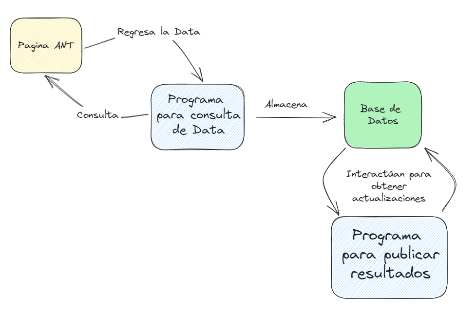

 # Controla tus multas

**Que es controla tus multas?**

El presente proyecto elaborado para el fin de modulo “Tratamiento de datos”, parte de la maestría en Ciberseguridad impartida por la Universidad Internacional del Ecuador, parte de una necesidad que tienen los conductores ecuatorianos a nivel de notificación de multas o infracciones de transito registradas a nivel nacional.

**Problemática**

En la actualidad en el Ecuador existen varias formas de realizar control a los vehículos de transporte de cualquier tipo que este sea. Cuando un conductor incurre en una falta esta debe ser notificada por la autoridad competente para su impugnación en los siguientes 3 días hábiles, de esta forma el conductor tiene la oportunidad de librarse o en todo caso pagar a tiempo el valor correspondiente a la falta. Lamentablemente se han implementado sistemas que realizan la multa automáticamente pero su gestión no realiza la notificación oportunamente, llegando incluso a reportarse después de años. 

La ANT pone a disposición de los usuarios un sistema para la consulta de estos valores ya sea por placa, cédula, ruc o pasaporte el sistema de consulta, el inconveniente es que si no ingresas a realizar la consulta no recibes ninguna notificación adicional. El link para su ingreso es el siguiente: <https://consultaweb.ant.gob.ec/PortalWEB/paginas/clientes/clp_criterio_consulta.jsp>

**Propuesta**

Este programa desarrolla una herramienta que a través del scraping nos permita revisar constantemente si hemos recibido una multa en la ANT mediante la revisión de los datos obtenidos en una web personal,  via correo electrónico o Whatsapp.

A continuación, detallamos un esquema de las conexiones a realizar:

**Instalación**

Es necesario tener instalado la librería Selenium, se lo puede realizar con el siguiente comando en la consola

    pip install selenium

**Desarrollo**

Para realizar la extracción de la data se ha trabajado en las siguientes actividades:

**1. Realizar un reconocimiento de la página a evaluar.**

Al ingresar a la pagina podemos apreciar que la misma consta de un combo box en el cual se despliegan las opciones disponibles, un botón para realizar el ingreso del valor a consultar y un botón para realizar la consulta.

**2. Determinar los componentes a emplearse en el programa.**

Se han determinado 3 componentes a los cuales mediante el driver de selenium manipularemos a nuestra conveniencia, esto son:

    Selector de opción: #ps\_tipo\_identificacion

    Input de información: #ps\_identificacion

    Botón de búsqueda: #frm\_consulta > div > a > img

**3. Diseñar el código para que ingrese y realice la solicitud de la información.**

Se desarrolla un código en lenguaje Python que mediante un algoritmo ordenado selecciona la opción de cédula de identidad, a continuación ingresa el input para realizar una consulta y posterior presiona sobre el botón para realizar la búsqueda.

    # Buscamos el selector deseado
    dropdown = driver.find_element(By.CSS_SELECTOR, '#ps_tipo_identificacion')

    # debemos seleccionar un dropdown
    select = Select(dropdown)

    # a traves del indice seleccionamos el correspondiente a la cedula para este caso
    select.select_by_index(3)

    # Identificamos el campo donde se ingresa el texto y agregamos el texto deseado
    text_field = driver.find_element(By.CSS_SELECTOR, '#ps_identificacion')
    text_field.send_keys("1715335004")

    # buscamos el boton y damos click para obtener la consulta
    consultar_button = driver.find_element(By.CSS_SELECTOR, '#frm_consulta > div > a > img')
    consultar_button.click()

**4. Explorar el resultado de la búsqueda a fin de definir los controles a tomar.**

Una vez obtenido el resultado de la búsqueda es necesario identificar con que elementos debemos continuar trabajando, en este caso hemos obtenido una tabla de la cual extraeremos la información necesaria.

La misma está identificada como: 

    #gview\_list10 > div.ui-state-default.ui-jqgrid-hdiv > div > table

**5. Realizar la conexión con la base de Datos para guardar la información.**

Posterior y una vez identificados los campos procederemos a generar la conexión con la base de datos y guardaremos los datos, para este caso hemos empleado una base de datos en MongoDB. Para realizarlo iteramos dentro de la tabla.

    # Iteramos a través de las filas de la tabla
    for fila in filas[1:]:  # Comenzamos desde la segunda fila para omitir los encabezados
        # Encontramos las celdas que contiene la tabla
        celdas = fila.find_elements(By.TAG_NAME, 'td')
        # Extrae los valores de las celdas "orden", "fecha" y "nombre"
        infraccion = celdas[0].text
        entidad = celdas[1].text
        citacion = celdas[2].text
        placa = celdas[3].text
        fechaemision = celdas[4].text
        fechanotificacion = celdas[5].text
        puntos = celdas[6].text
        sancion = celdas[7].text
        multa = celdas[8].text
        remision = celdas[9].text
        totalpagar = celdas[10].text
        articulo = celdas[11].text

    # Creamos un diccionario con los datos
    registro = {
    'infraccion': infraccion,
    'entidad': entidad,
    'citacion': citacion,
    'placa': placa,
    'fechaemision': fechaemision,
    'fechanotificacion': fechanotificacion,
    'sancion': sancion,
    'puntos': puntos,
    'multa': multa,
    'remision': remision,
    'totalpagar': totalpagar,
    'articulo': articulo
    }

    # Inserta el documento en la colección de MongoDB
    base.insert_one(registro)

Finalmente se han insertado los registros en la base, la misma dará paso a la consulta posterior por el programa de lectura y publicación

**Alcance**

En esta primera etapa se ha registrado la solicitud y almacenamiento de la información, la misma que será notificada al usuario final mediante la visualización WEB. En un siguiente scoope se tratará la notificación mediante correo y Whatsapp.

